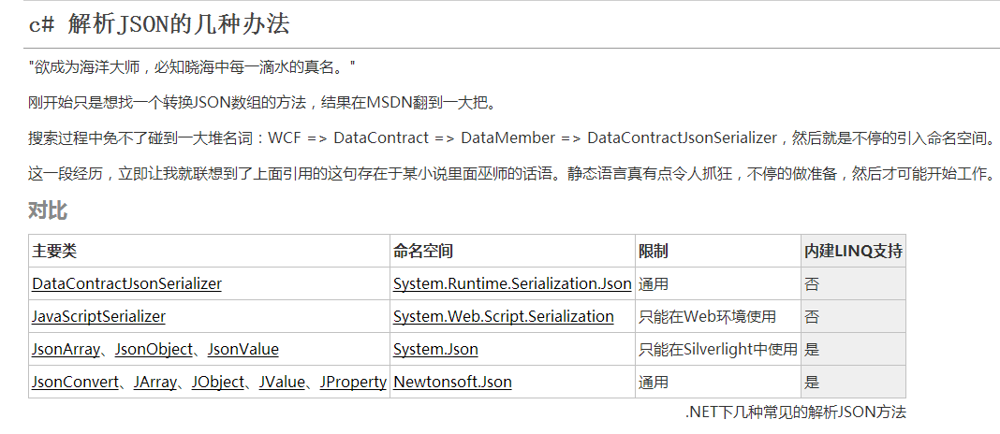

# HolleWord 项目

 HolleWord项目主要是自学的一些内容，比较杂乱，全部是基础内容，这里对每一个点分开

## ScratchOff 类
抽奖类项目，主要有：
+ 递归 RecurrenceNumbers
+ 数组/列表内容是否为连续数字 IsContinuation
+ List<string>和List<int>互相转换
``` java
// List<string> 转 List<int>
var list = (new[]{"1","2","3"}).ToList();
var newlist = list.Select<string,int>(x =>Convert.ToInt32(x));

 // List<int> 转List<string> 
List<int> list = new List<int>(new int[] { 1,2,3 } );
List<string> newList = list.ConvertAll<string>(x => x.ToString());
```
+ 数组中随机取值 GetRandomCardNumbers
+ Linq 数组交叉取值 GetRandomNoExistCardColor
+ 产生随机数
``` java
    private static int GetRnd()
        {
            //这样产生固定的随机数（注释举例： 0 ~ 100000的强随机数（含100000））
            int max = MAXRNDNUMBER;
            int rnd = int.MinValue;
            decimal _base = (decimal)long.MaxValue;
            byte[] rndSeries = new byte[8];
            //RNGCryptoServiceProvider rng = new RNGCryptoServiceProvider();
            //rng.Dispose();
            using (RNGCryptoServiceProvider rng = new RNGCryptoServiceProvider())
            {
                rng.GetBytes(rndSeries);
                //不含100000需去掉+1
                rnd = (int)(Math.Abs(BitConverter.ToInt64(rndSeries, 0)) / _base * (max + 1));
                return rnd;
            }
        }
```
+ 类型强制转换等...

## CSharp6 类 C#新特性学习
+ 表达式方法体 =>
+ 字符串插值
+ 空操作符 ( ?. )
+ 在Catch和Finally里使用Await
+ 自动属性初始化器
+ 只读自动属性


## Json 类 Json处理



## RNGCryptoServiceProviderDemo 类 随机数
+ 产生随机数
+ 产生随机字符